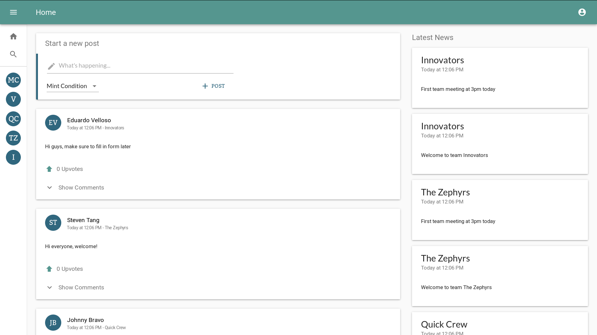

# Workflow
Project for Web Information Technologies (INFO30005) - Semester 1, 2018

**Made by:** [Armaan Mcleod](https://github.com/OpticGenius), [Wei How Ng](https://github.com/ngweihow) \& [Steven Tang](https://github.com/yc)  
**Built with:** Node.JS, Express, MongoDB, React, Redux, React Admin

**Credentials for demo:**  

| User Type | Username | Password |
|-----------|----------|----------|
| Admin     | admin    | admin    |
| Manager   | jsmith   | manager  |
| User      | barryw   | berry    |

## Configuration
### Development (api server)
- Ensure that your version of Node.js supports async/await
- Get packages using `npm install`, `npm install --prefix app/` and `npm install --prefix admin/` (for the server, frontend app and admin interface respectively)
- Install `mongo` (server)
- Start a Mongo instance using `npm run localdb` or equivalent (a mongod instance could have also been started automatically)
- Run `npm run watch` and `npm run devstart` to start the server in the development context (on port 5000 of localhost)
- Use `npm run prettify` to prettify Javascript code (it may be necessary to run `sudo npm -g install prettier` to install `prettier`)

**Note:** `sudo service stop mongodb` may be required on certain Linux distributions to free up the mongo port when running `npm run localdb`.  

### Development (React/admin app)
- Ensure that you're in the `app/` or `admin/` directory
- Ensure that the API server is started
- Add some sample data with `npm run populate`
- Run `npm install`
- Run `npm start`

### Production
#### Method 1 - Docker (manual deploy)
Set the `REACT_APP_API_URL` environment variable in the `Dockerfile` to reflect the setup of your API server before running the build.  
Use `sudo docker build -t flow .` to build a docker image and subsequently deploy the image.  

#### Method 2 - Docker Heroku build (Automated build and deploy)
Set the `REACT_APP_API_URL` environment variable in the `Dockerfile` to reflect the setup of your API server before running the build.  
Use `heroku stack:set container -a <app_name>` to set the app type before pushing the code (if using automated builds).  

#### Method 3 - npm (manual build/deploy)
Install dependencies and run `npm run build` to build the app without docker.  
Ensure that the `REACT_APP_API_URL` environment variable is set and available during the build process (as it is used by the frontend apps to determine the prefix of each request URL).  
Deploy files in the generated `build/` directory and use `npm start` to run the app.

Additionally, please set the following environment variables and make them available to the deployed server:  
- `MONGO_URL`:  connection URL of mongo instance
- `SESSION_SECRET`: hashes user sessions
- `CORS_ORIGIN`: origin (protocol + hostname + port) of frontend
- `PORT`: port that API server should start on (if applicable)

### Tests & Coverage
- `npm test`
- Run `npm run report` to generate coverage report

## License
MIT, unless otherwise specified

